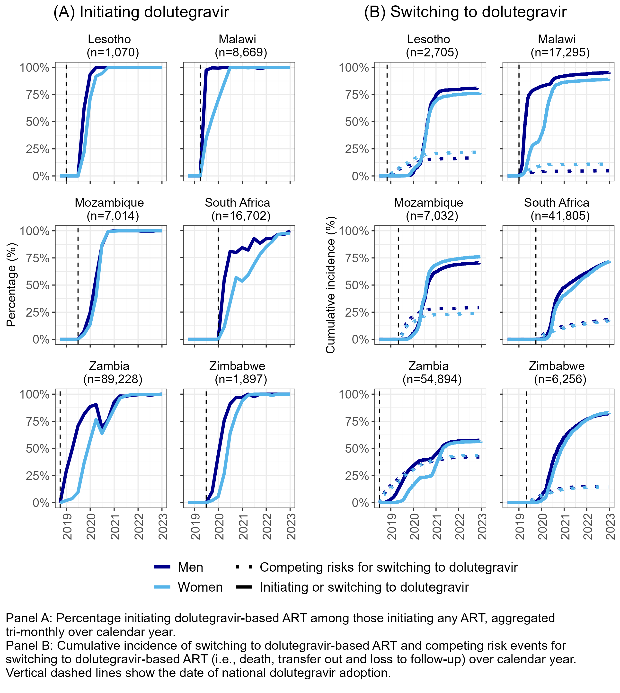
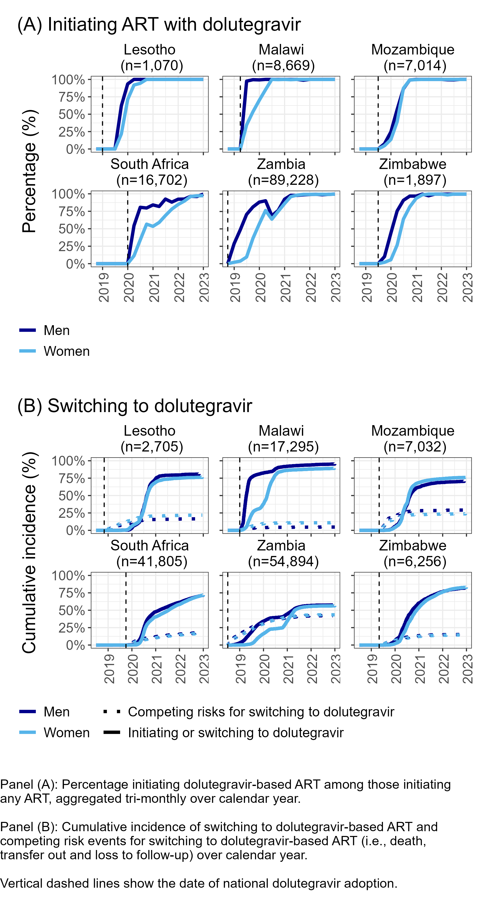

# Assessing DTG uptake among those newly initating ART and those switching to DTG ART.

This repository shares the R coding files used to produce the output included in the following:

### IWHOD 2024 conference abstract and poster presentation: 

> Trends in dolutegravir uptake by sex in Southern Africa. Zaniewski E, Fox MP, Fatti G, Muula GK, Mbewe S, Romo M, de Waal R, Egger M, Rohner E. [IWHOD 2024](http://https://iwhod.org/)

## Data
This analysis included HIV cohort data from The International epidemiology Databases to Evaluate AIDS Southern Africa collaboration (https://www.iedea-sa.org), which collects de-identified patient-level data from participating cohorts in Lesotho, Malawi, Mozambique, South Africa, Zambia and Zimbabwe. 

## Methods

Quantified uptake of DTG-based ART among six countries in Southern Africa between 2018-2023 by looking at DTG uptake among two cohorts of patients:

1) **Initiating cohort:** comprised of treatment-naïve individuals newly starting ART  
    - calculated percentage initiating DTG-based ART aggregated tri-monthly.

2) **Switching cohort:** treatment-experienced individuals on non-DTG-based ART
    - calculated cumulative incidence of switching to DTG-based ART using Kaplan-Meier and Aalen-Johansen methods; the latter method considered the competing risk events of death, transfer out and loss to follow-up.

Statistical analyses performed in R Statistical Software (v4.3.3; R Core Team 2022) with RStudio (version 2023.12.1).

## Coding files in R

[Figure in abstract](analyses/012_IWHOD2024_Abstract_Fig1_v2.Rmd)   

[Figure in poster](analyses/013_IWHOD2024_Poster_Fig1_v3.Rmd)  

## Abstract Figure

## Poster Figure

[![CC BY-NC-SA 4.0][cc-by-nc-sa-image]][cc-by-nc-sa]

[cc-by-nc-sa]: http://creativecommons.org/licenses/by-nc-sa/4.0/
[cc-by-nc-sa-image]: https://licensebuttons.net/l/by-nc-sa/4.0/88x31.png
